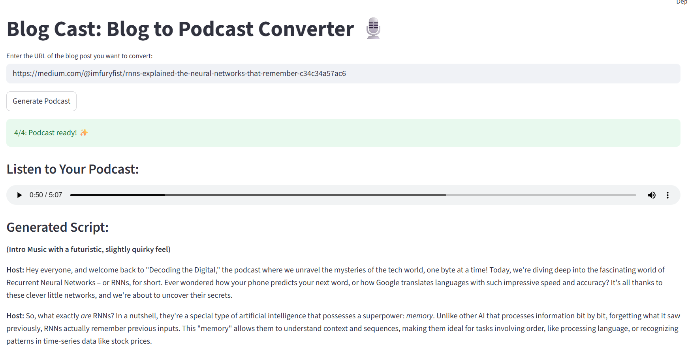

# Blog Cast: AI-Powered Blog-to-Podcast Converter

Blog Cast is a simple web app that turns any blog post into a ready-to-listen podcast episode. Just paste a URL, and AI agents will scrape the content, write a conversational script, and generate the audio for you.



## Key Features

  * **URL to Audio:** Converts any public blog post into an audio file.
  * **AI Scripting:** Uses Google's Gemini to create a natural, engaging podcast script from the article's content.
  * **High-Quality Voice:** Leverages ElevenLabs for realistic text-to-speech conversion.
  * **Simple Interface:** Provides a clean UI to play and download the final MP3 file.

-----

## How It Works

The application follows a simple, automated workflow:

1.  **Frontend:** The user interface is built with **Streamlit**.
2.  **Content Scraping:** **Firecrawl** is used to reliably extract the main content from the provided blog post URL.
3.  **Script Generation:** The scraped text is sent to **Google's Gemini API** with a prompt that instructs it to act as a podcast host and rewrite the content into a script.
4.  **Audio Generation:** The final script is sent to the **ElevenLabs API** to generate the audio file.

-----

## Setup and Installation

Follow these steps to run the project on your local machine.

### 1\. Clone the Repository

First, clone this project's repository to your local machine.

```bash
git clone https://github.com/furyfist/BlogCast.git
cd blog-cast
```

### 2\. Create a Virtual Environment

It's highly recommended to use a virtual environment to manage project dependencies.

```bash
# Create the virtual environment
python -m venv venv

# Activate it
# On Windows:
venv\Scripts\activate
# On macOS/Linux:
source venv/bin/activate
```

### 3\. Install Dependencies

Install all the required Python libraries from the `requirements.txt` file.

```bash
pip install -r requirements.txt
```


### 4\. Set Up API Keys

The application requires API keys from three services. Store them securely using Streamlit's secrets management.

1.  Create a folder named `.streamlit` in the root of your project directory.
2.  Inside that folder, create a file named `secrets.toml`.
3.  Add your API keys to the file in the following format:

<!-- end list -->

```toml
# .streamlit/secrets.toml

FIRECRAWL_API_KEY = "your_firecrawl_api_key_here"
GEMINI_API_KEY = "your_gemini_api_key_here"
ELEVENLABS_API_KEY = "your_elevenlabs_api_key_here"
```

-----

## How to Use the App

Once the setup is complete, run the application from your terminal:

```bash
streamlit run app.py
```

Your web browser will open a new tab with the running application.

1.  Paste a blog post URL into the input field.
2.  Click the "Generate Podcast" button.
3.  Wait for the process to complete.
4.  Play the generated audio directly on the page or use the download button to save the MP3 file.